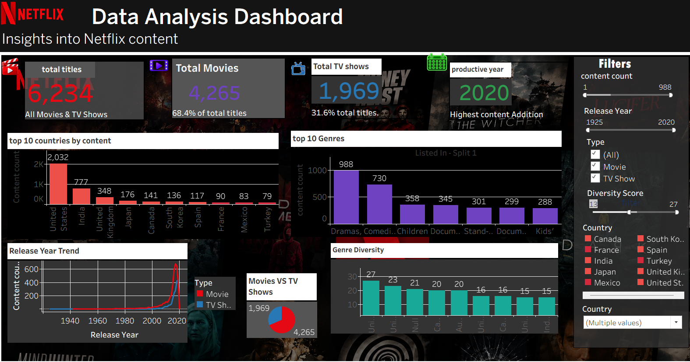

<div align="center">

# 🎬 NETFLIX DATA ANALYSIS


<br>


</div>

---

<div align="center">

### 📊 NETFLIX DATA ANALYTICS

**A complete Netflix Data Analysis & Interactive Tableau Dashboard**


</div>

---
# 🎯 Project Overview

This project analyzes Netflix Movies and TV Shows to discover meaningful patterns and insights using **Python, SQL and Tableau**.

The dashboard provides insights into:

✅ Total Movies and TV Shows  
✅ Top Countries by Content  
✅ Top Genres  
✅ Release Year Trends  
✅ Genre Diversity  
✅ Interactive Filtering

---

# 📊 Dataset Information

| Attribute | Details |
|------------|----------|
| Dataset | Netflix Titles |
| Rows | 6,223 |
| Columns | 13 |
| File Type | CSV |
| Content | Movies + TV Shows |

---

# 🛠️ Tools & Technologies

| Tool | Purpose |
|-------|----------|
| 🐍 Python | Data Cleaning & Analysis |
| 🐼 Pandas | Data Manipulation |
| 🗄 SQL | Querying |
| 📊 Tableau | Dashboard |
| 📁 CSV | Dataset |
| 💻 GitHub | Documentation |

---

# 🧹 Data Cleaning

✔ Removed missing values  
✔ Handled null data  
✔ Standardized fields  
✔ Processed genres and countries  
✔ Prepared final cleaned dataset

---

## 📈 Dashboard Preview

<div align="center">



</div>

---

## 🎯 Dashboard Features

### 🎬 Content Analysis

```text
Total Titles
Movies
TV Shows
Most Productive Year
```

### 🌍 Country Analysis

```text
Top 10 Countries by Content
```

### 🎭 Genre Analysis

```text
Top 10 Genres
Genre Diversity
```

### 📅 Time Analysis

```text
Release Year Trend
```

### 🔎 Interactive Filters

```text
Content Count
Release Year
Type
Diversity Score
Country
```

---

## 🐍 Python Analysis

Python and Pandas were used for data preparation and analysis.

```text
✓ Data Loading
✓ Data Cleaning
✓ Missing Value Handling
✓ Content Type Analysis
✓ Country Analysis
✓ Genre Analysis
✓ Release Year Analysis
```

### Example

```python
import pandas as pd

df = pd.read_csv("netflix_titles_cleaned.csv")

print(df.head())
print(df.shape)
print(df.info())
```

---

## 🗄️ SQL Analysis

SQL was used for querying and aggregation.

### Movies vs TV Shows

```sql
SELECT type, COUNT(*) AS total_titles
FROM netflix_titles
GROUP BY type;
```

### Country Analysis

```sql
SELECT country, COUNT(*) AS content_count
FROM netflix_titles
GROUP BY country
ORDER BY content_count DESC;
```

### Genre Analysis

```sql
SELECT listed_in, COUNT(*) AS genre_count
FROM netflix_titles
GROUP BY listed_in
ORDER BY genre_count DESC;
```

---

## 🔥 Key Insights

### 🎬 Content Type

Movies form the larger portion of the analyzed Netflix content.

### 🌎 Countries

The United States contributes the highest number of titles in the analyzed dataset.

### 🎭 Genres

The dashboard highlights the most frequently represented content genres.

### 📅 Release Years

The release-year analysis shows how Netflix content representation changes across different years.

### 🧩 Genre Diversity

Genre diversity helps explore how varied Netflix content categories are.

---

## 🔄 Project Workflow

```text
                 ┌─────────────────────┐
                 │   NETFLIX DATASET   │
                 └──────────┬──────────┘
                            ↓
                 ┌─────────────────────┐
                 │    DATA CLEANING    │
                 │    PYTHON/PANDAS    │
                 └──────────┬──────────┘
                            ↓
                 ┌─────────────────────┐
                 │    DATA ANALYSIS    │
                 │        SQL         │
                 └──────────┬──────────┘
                            ↓
                 ┌─────────────────────┐
                 │  VISUALIZATION      │
                 │      TABLEAU        │
                 └──────────┬──────────┘
                            ↓
                 ┌─────────────────────┐
                 │      INSIGHTS       │
                 └─────────────────────┘
```

---

## 📂 Project Structure

```text
Netflix-Data-Analysis-Dashboard/
│
├── 📄 README.md
├── 📊 netflix_titles_cleaned.csv
├── 📊 netflix_analysis.csv
├── 🐍 netflix_analysis.py
├── 🐍 sql_connection.py
├── 📈 1Netflix.twb
└── 🖼️ dashboard.png
```

---

## 🔗 PROJECT LINKS

### 💻 GitHub Repository

[🚀 Open GitHub Repository](https://github.com/Minu-Kumar/Netflix-Data-Analysis-Dashboard)

### 📊 Live Tableau Dashboard

[🎬 Open Tableau Dashboard](https://public.tableau.com/app/profile/minu.kumar3707/viz/1netflix_17869426197230/newdashboard?publish=yes)

---

## 💡 Business Value

This project demonstrates how raw data can be transformed into an interactive analytical dashboard.

```text
📊 Understand Content Distribution
🌍 Explore Country Contribution
🎭 Analyze Genre Patterns
📅 Study Release Trends
🎬 Compare Movies and TV Shows
🧩 Explore Content Diversity
```

---

## 🚀 Future Improvements

```text
[ ] Add more advanced Tableau calculations
[ ] Add more interactive dashboard features
[ ] Explore additional Netflix trends
[ ] Add predictive analytics
[ ] Add more business-focused insights
```

---

<div align="center">

## 👩‍💻 MINU KUMAR

### 📊 Aspiring Data Analyst

```text
Python • SQL • Tableau • Power BI • Excel
```

<br>


<br><br>


<br>


</div>
